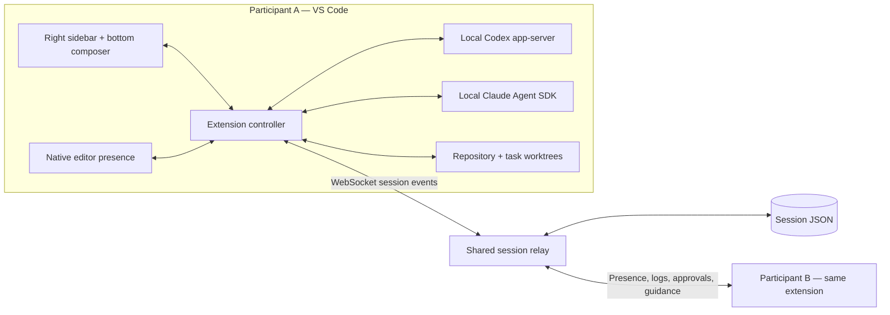

# Implementation architecture

## Shape of the application

The extension uses VS Code’s native editor, explorer, terminal, source control and search. React webviews supply the center session dashboard, right session sidebar and bottom agent composer. The standalone browser preview reproduces the reference workspace for design review; its file tree and editor are sample UI. The installed extension uses your actual files.

### Session service

`src/relay/server.ts` owns authoritative room state. Each socket is bound to a participant after invite/resume authentication. Requests are validated with Zod. The server enforces roles and mutation ownership, binds approvals to the executor’s current run, and routes guidance to an exact participant/run pair. Only that participant can acknowledge delivery. Approval resolution is first-writer-wins.

Events update one ordered session revision. Document updates send the changed document and a state snapshot so stale note anchors reach every participant; other session events broadcast snapshots. Bounded history, message size/rate limits, connection heartbeat and reconnectable membership keep the deployment small. Disk snapshots persist plans, memory, comments, history, task records, CRDT states, hashed invitations and hashed resume tokens. Invitations have expiry and remaining-use counts; hosts can revoke them without invalidating established memberships. Disconnected executors are marked stopped; pending approvals fail closed.

Hosted connections verify a GitHub token on every connection and optionally require active membership in a configured organization. Resume tokens are bound to the verified identity. `SessionStore` encrypts hosted snapshots and their backups with AES-256-GCM, writes an fsynced temporary file, and replaces the previous snapshot atomically. An incorrect key or damaged ciphertext fails startup. Health checks report failed persistence. Default local development remains available without hosted identity/encryption configuration.

The client associates messages and close events with the current socket, so a closing old connection cannot reset a new session. The extension stores per-workspace resume credentials in VS Code SecretStorage. A local relay restarts when reopening its saved session.

### Agents

Version 0.5 extends relay-side prompt/file conflict checks and atomic work reservations before both main and isolated agent launches. Both paths receive unified session context and a `.lattice/session-context.json` refreshed during the run. Models must consult that file to learn mid-run changes. There is no central planner or dependency scheduler. See [live workspace and coordination](LIVE-WORKSPACE.md) for the algorithm, lease behavior, limits and tests.

`src/providers/codex.ts` speaks line-delimited JSON-RPC to `codex app-server`. It initializes a thread, starts/resumes turns, normalizes streamed text/tool/usage events, handles approval callbacks, and supports turn steering/interruption.

`src/providers/claude.ts` uses the installed Claude CLI through the official Agent SDK. Partial messages and final results feed the same UI contract. SDK tool-permission requests use the shared approvals flow. Live guidance is queued into the same streaming SDK query and is bound to the current run.

The extension executes one main-checkout agent plus isolated task executors, up to four simultaneous runs per participant. `TaskExecutor` owns its provider process, worktree, live file publisher, approval waiters and streamed transcript. The relay records each task by owner/run ID and accepts guidance, approvals and usage for that exact run. Authentication and billing belong to the executor. A cross-provider switch starts/resumes that provider’s own conversation with shared session context; it does not convert provider-private conversation state.

Usage records are cumulative per run and applied monotonically, preventing duplicate reports or concurrent tasks from overwriting totals. Session budgets prevent new runs and cause participating extensions to stop local agents once reported usage reaches the limit. They cannot enforce provider-side spend when usage reporting is delayed or absent.

Approval modes use the provider’s normal workspace/permission behavior. “Ask permission” does not mean every file write or tool call requires a card: the provider decides which operations require approval. Unknown interactive protocol requests fail closed.

### Worktrees

An isolated task starts from the current Git HEAD in an extension-owned worktree. On completion, the UI exposes its binary-capable diff, including untracked new files. The exact reviewed patch must still match at integration time. When `lattice.taskCheckCommand` is configured, checks must have passed for that exact patch and command. The main checkout must be clean and `git apply --check` must succeed. Applying leaves local changes for normal review/commit. Task worktree metadata persists with the workspace. Handoffs can carry the reviewed patch, base commit, task description and recent conversation; recipients import into a fresh worktree at the same base. There is no automatic commit, push, PR, or worktree cleanup.

### UI and presence

`SessionWorkspace` now publishes the host’s eligible files and opens a managed live workspace automatically when a guest joins. `WorkspaceMirror` uses persisted checksum baselines, bounded byte transfers and native editor updates, preserving overlapping local edits. It replaces legacy incoming file application while active. Guests receive an independent Git snapshot, so isolated worktrees still start from local HEAD and patch handoffs retain their same-base requirement. See [workspace architecture and boundaries](LIVE-WORKSPACE.md).

The native secondary sidebar and panel contribution IDs use VS Code-compatible names. The webviews have a restrictive content policy, nonce scripts, escaped React text, and reduced-motion support. Public GitHub avatars are optional.

VS Code’s public extension API supports text badges in file decorations, not arbitrary photo widgets inside native editor tabs. This version uses initials in the explorer and cached avatar images beside the active code position; photos also appear in the right sidebar. The reference’s photo-in-tab treatment would require a custom editor shell or a VS Code fork.

## Live agent source updates

`LiveSync` observes real VS Code document changes and filesystem writes while an agent runs. It groups changes per file over a 90 ms interval, preserves source text, computes the edited position, and publishes Yjs character operations together with its base checksum. `src/shared/collaboration.ts` initializes a deterministic immutable seed and gives subsequent edits distinct Yjs client identities. The relay merges operations against the existing document, validates the result and persists its CRDT state. Concurrent updates based on the same seed converge; legacy snapshot-only writes still require matching versions. Worktree documents have separate keys and never apply automatically to another participant’s main checkout. See [Yjs update semantics](https://docs.yjs.dev/api/document-updates).

Receiving editors apply a version only when the physical file and any open buffers are compatible with the known base/last applied version. Unsaved buffers, changed files and save-hook differences pause that file. The buffer lookup resolves macOS/symlink aliases before checking for dirty state. VS Code workspace edits preserve normal undo behavior; received files are saved. Per-file queues, suppression and updated baselines prevent echo loops between active executors.

The **Follow live edits** webview displays streamed source with an avatar caret. CSS transform interpolation supplies smooth movement and respects reduced motion. It can continue displaying remote source when local synchronization is paused. This does not assume that a CLI emits keystrokes: an atomic provider write arrives as a block, then the caret moves to the changed region.

`SharedEditor` binds an explicitly enabled native text buffer to Yjs. Local edits retain their operation identities while incoming changes merge into the buffer using incremental VS Code edits. This mode deliberately allows unsaved concurrent edits; buffers outside it retain the ordinary dirty-file guard. Pending changes replay after a socket reconnect and are copied to SecretStorage for crash recovery. Pausing synchronization affects both modes.

`FileLifecycle` observes native rename/delete events and publishes guarded operations. The receiver verifies the physical path, unsaved buffers, original checksum and destination containment. Deletions go to trash. Main-checkout agent filesystem deletions are also observed; filesystem renames outside native VS Code events appear as delete/create. Freshly joining/reloading clients do not replay historical destructive operations against a new checkout; temporary socket reconnects keep the same pending-operation context.

Limits: 100 documents per session, 32,000 characters per document, 180,000 encoded CRDT characters per document, and a source-extension allowlist. Large accumulated CRDT histories require a new session. Character convergence cannot guarantee semantic correctness of simultaneous code changes; review/tests remain necessary.

The optional `FileSharing` path supports deliberate, saved-file proposals with exact reviewed hashes and per-participant receipts. It supplements live synchronization for review-oriented work.

## Feature boundary and launch work

Version 0.5 extends the working native product. It does not claim every reference service or a completed public launch. The deployable configuration and remaining external dependencies are detailed in [Deployment](DEPLOYMENT.md) and [Release readiness](RELEASE-READINESS.md).

| Area | Current implementation | Remaining work |
| --- | --- | --- |
| Shared workspace | Automatic managed-folder hydration, bidirectional byte sync, explicit character-level editing, guarded file operations, follow cursor, offline replay | File-mode/private-session-commit transfer, long-running latency trials and semantic conflict resolution |
| Membership | Verified GitHub identities, organization restriction, expiring/revocable invites and roles | Connect the actual organization and deploy the selected host |
| Agent panel | Codex/Claude runs, history, stop, role-gated targeted steering for both providers | Independent per-provider draft queues, full cross-provider context conversion, additional providers |
| Task work | Four agents per executor, isolated worktrees, shared registry/context, prompt conflict reservations and optional required checks | Central planning, dependency scheduling, semantic conflict analysis and a paid-provider trial |
| Memory | Indexed keyword retrieval, source-linked ingestion, verified-membership search across sessions, encrypted storage | Semantic similarity ranking is not implemented |
| Handoffs | Task/context/patch transfer, terminal-limit offers, atomic acceptance and continuity notes | Provider-private executor state cannot move between accounts |
| Review | Stale file-linked comments, checked reconciliation candidates, exact-tree PR review and GitHub tracking | Complete semantic conflict prevention |
| Sessions | Branch worktrees, dashboard, PR completion, persistent snapshots, saved memberships and recovery | Provision backup storage and test recovery on the actual host |
| Usage | Per-task reported tokens/cost, aggregate totals and coordination budgets | Provider invoice reconciliation and commercial subscriptions |
| Product shell | Native VS Code integration and managed live workspaces | Dedicated desktop shell, panes, reference backend parity |

### Launch sequence

1. Choose a host/domain and optional GitHub organization; deploy the supplied container and TLS proxy.
2. Verify signed-in provider runs and invitations across two machines; run a longer editing/reconnect trial.
3. Configure backup/restore and the project’s required check command.
4. Connect a repository/publisher for CI execution and automatic Marketplace updates.
5. Obtain provider billing/admin access and choose payment infrastructure if commercial billing is part of launch.

Keep the native extension and shared protocol separate from hosting and provider adapters. This allows the same collaboration service to support a future desktop shell without replacing the session model.

## Feature-session workflow (0.5)

`SessionFlow` polls repository session context and upstream Git changes. `branch-workflow.ts` creates worktrees from fetched main, snapshots with an alternate Git index, prepares an isolated reconciliation candidate, runs required checks and integrates only if both local HEAD/tree and the shared workspace revision remain unchanged. Failures retain recovery refs and a candidate that can be reviewed, edited and checked again. PR publishing binds the reviewed tree, pushes the exact commit and recovers an ambiguous create response by checking GitHub. `session.observe` reads saved sessions without joining or replacing active sockets; terminal updates require the owner's resume proof and the exact linked PR number.

Owner steering is immediate. Editor guidance waits for the target agent owner's approval and expires with the exact run. Both adapters support live guidance. Terminal provider limits create atomic handoff offers; acceptance adds a linked memory note and executes using the accepting participant's provider. Shared source carries main-workspace progress, while isolated offers include a bounded patch requiring a matching Git base.

File and memory notes carry content anchors. Byte changes/deletions mark them stale. Explicit review refreshes the anchor; stale memories are excluded from the automatic agent context. See [Workflow](WORKFLOW.md) for operational limits.
